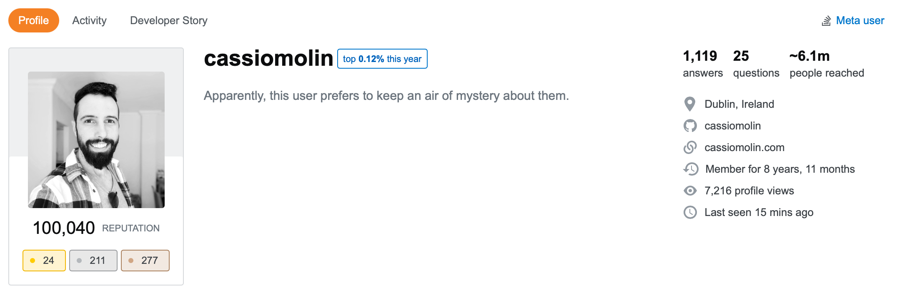
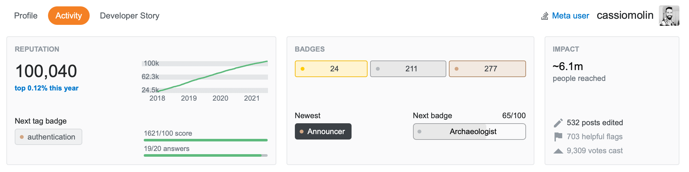
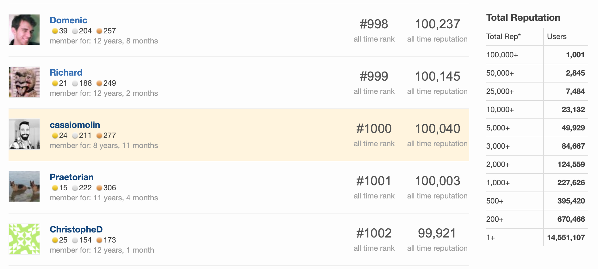
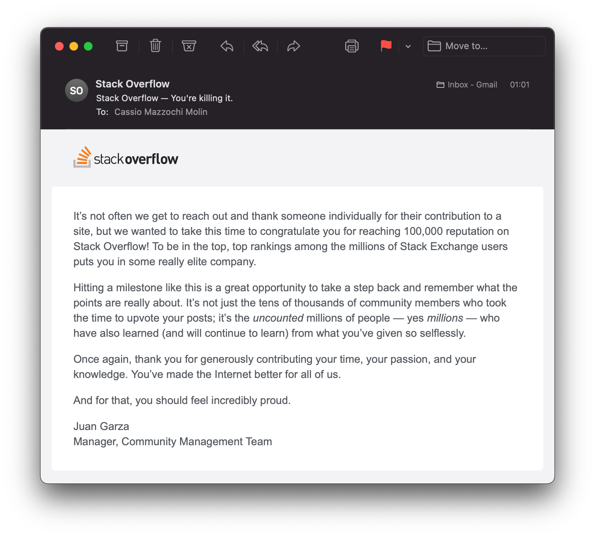

Yesterday I reached [100,000 reputation points on Stack Overflow](http://stackoverflow.com/u/1426227), the largest online community for professional programmers and enthusiasts.

As Stack Overflow defines it, reputation points indicate how much the content posted by a user is relevant and trusted by the community.
As I write this post, there are 14.5 million users registered in Stack Overflow, and I am among the 1,001 users who hit this milestone!

But at the end of the day, reputation points are just numbers. While I am proud of my achievement, my participation on Stack Overflow was never a quest for reputation points.

What matters the most to me is how much I learned from this experience. And the 1,100+ answers I posted till now helped me to become a better software engineer. It's been all about learning, sharing knowledge and helping others.

